# Rental Market in Valencia, Spain
***

## 0. Introduction
***
> This project presents an **analysis of the rental market in Valencia** to identify the key characteristics of the houses offered. This can help optimize strategies for renting or investing in real estate. It may also assist individuals searching for a new home in Valencia to better understand the market dynamics in one of Spain's trendiest cities.
>
>Additionally, **a model was trained to estimate rental prices**, providing a preliminary estimation based on the real estate environment in Valencia. If you're considering investing in a property to rent out, you can also use this model to compare potential purchase prices with estimated rental income.
>
>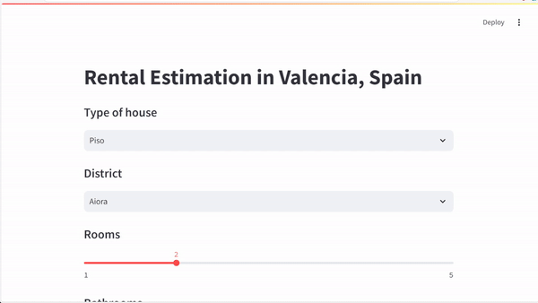

> Before diving into the details, it’s important to note that data on this subject is highly valuable, which is why major rental websites protect it carefully. As a result, **the data used in this project is not as complete as we would like.** For instance, not every district in Valencia has sufficient information to be reliable. The model trained only includes the districts marked in green on the following map, while other areas are aggregated, making them less precise.
>
> 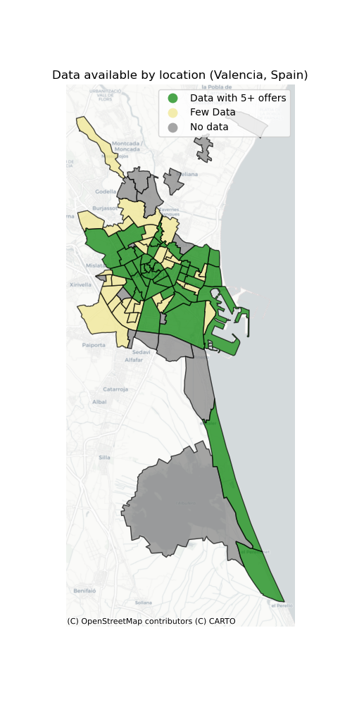

> ### Price distribution
>
>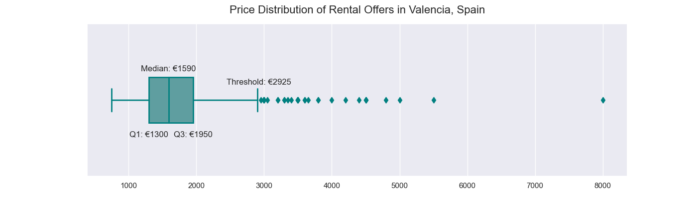 

### Technical key points 
***
- Webscrapping highly secured data
- Filling missing values using ratios
- Modelling optimization: dropping extreme values and enriching dataset with new feature (new webscrapping)
- Next steps: propose future lines of work

### Economic insights 
***
- Districts in the city center are more expensive
- Some districts near the center may represent market opportunities due to their relatively lower prices
- Smaller houses have a higher price per square meter, most of them are located in the city center
- Houses with just one room are very small and, therefore, have a higher price per square meter

## 1. Data 
***

### 1.1.  Webscrapping

> As mentioned earlier, data on this topic is difficult to obtain. Major rental companies invest heavily in preventing others from scraping their websites. After failing to bypass the top companies' security measures, we managed to scrape data from a second-tier website with fewer observations.
>
> The tools used for data retrieval were: 
>> **Selenium: to open and scroll through pages, avoiding lazy loading and retrieving the HTML file.**
>>
>> **Beatiful Soup: to extract the necessary information.**
>
> #### The web scraping code and datasets are not shared for legal reasons.
 

### 1.2. Data restructuring

> This section introduces the _**Data_restructuring.ipynb**_ file, which is designed to help stakeholders better understand the information retrieved from the website without sharing the scraping code or datasets.

### 1.3 Nan values filling

> It's common when working with data to encounter incomplete features, and this case is no exception. Various strategies were used to fill the missing values, which are detailed in the _**Data_exploration.ipynb**_ file. Some of the more interesting methods are worth highlighting. 
>
> At first glance, features like the number of rooms and surface area are very important, so a simple imputer may not work well. More creative approaches were needed, such as calculating ratios to estimate missing values.
>> For instance, to fill in missing surface area values, we used observations where data was complete to calculate a **ratio between the surface area and different parts of the house. These spaces were weighted** based on their size relative to a room. The equation below defines this constant:
>>
>> $$Ratio = \frac{1}{n} \times \sum_{k=1}^n  \frac{Surface_k [m^2]}{1 \times Rooms_k + 0,5 \times Bathrooms_k + 0,75 \times Terrace_k + 0,25 \times Balcony_k} $$ 
>>
>> After calculating this ratio, for listings where the number of rooms was known but the surface area was missing, we estimated it by multiplying their weighted values by the ratio.
>>
>> $$Surface Estimation_k = Ratio \times (Rooms_k + 0,5 \times Bathrooms_k + 0,75 \times Terrace_k + 0,25 \times Balcony_k)$$

### 1.4. Final features + number of observations
> **Number of observations: 711**
>
> **Features**
>
>    - **House_type:** Type of the house written in the offer. 
>    - **Location:** District of the city where the house is located. 
>    - **Furnished:** Whether the house is furnished or not. 
>    - **Elevator:** Whether the house has an elevator or not. 
>    - **Terrace:** Whether the house has a terrace or not. 
>    - **Balcony:** Whether the house has a balcony or not. 
>    - **Storage:** Whether the house has a storage or not. 
>    - **Rooms:** Nº of rooms. 
>    - **Bathrooms:** Nº of bathrooms. 
>    - **Surface:** Square meters of the house. 
>    - **Agent_cat:** Type of real estate agent managing the offer (added during model optimization, can also indicate Premium/Non-premium house).
>    - **Price:** Target variable (rent).

## 2. Analysis
***
>A complete analysis of the dataset's characteristics is available in the _**Data_exploration.ipynb**_ file. Here, we present the most relevant insights.

### 2.1. Price per square meter by Location

> One of the most common metrics for understanding the real estate market is the price per square meter. This variable was calculated, and the graph below shows the districts with the highest and lowest prices. Though simple, this metric is crucial for grasping the city's real estate dynamics.
> 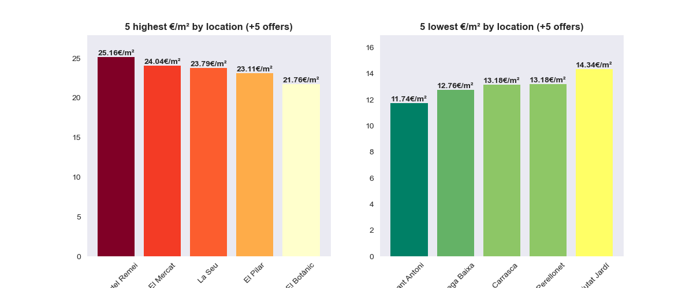    
> 
> The map below illustrates the price per square meter for each district, showing a clear pattern: **districts in the city center are more expensive** than those farther away. Additionally, **some districts near the center may represent market opportunities** due to their relatively lower prices.
> 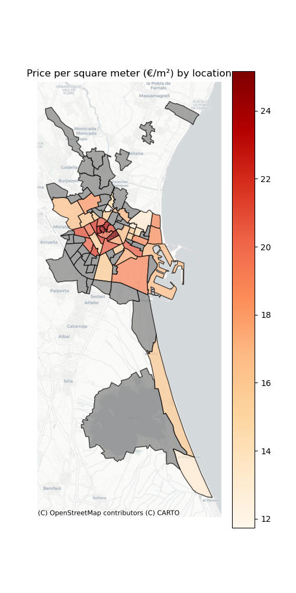

### 2.2. Price per square meter by nº of rooms

> Typically, one might expect that the more rooms a house has, the more expensive it is. However, if we examine the price per square meter, the opposite is true. As shown in the boxplots below, houses with fewer rooms tend to have a higher price per square meter. Two hypotheses were formulated to explore this behavior:
>> **<ins>Hypothesis 1:</ins> One-room houses are small, so they have a higher €/m² due to a minimum price threshold.**  
>> **<ins>Hypothesis 2:</ins> Houses with more rooms are located in lower €/m² zones.** 
>
> 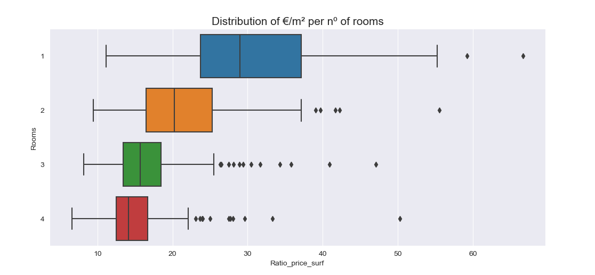

#### 2.2.1. Size by rooms

> To check the first hypothesis, the average surface area for each room count was plotted. **Houses with just one room average 50 m², and the largest increase in surface area (66%) occurs between one- and two-room houses.** We can conclude that one-room houses are significantly smaller.
>
> 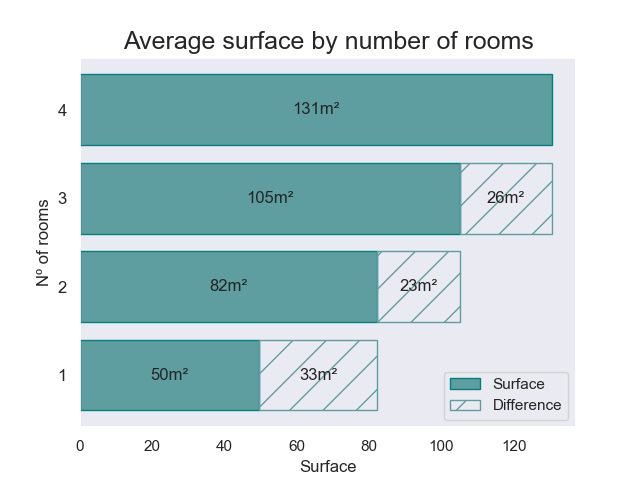

#### 2.2.2. Nº of rooms by location

> To verify the second hypothesis, locations were categorized by price per square meter in four ranges: ['<16 €/m²', '16-19 €/m²', '19-22 €/m²', '>22 €/m²']. **The higher the price per square meter, the fewer rooms houses** in that area tend to have. A map further illustrates that **the highest prices per square meter are found in the city center, where smaller houses are more common.** 

'                          | '                         
:-------------------------:|:--------------------------: 
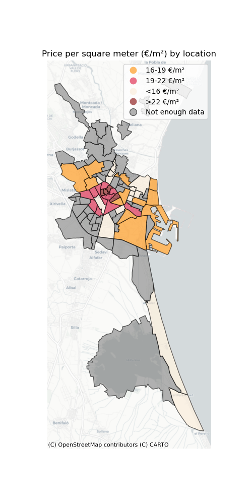 | 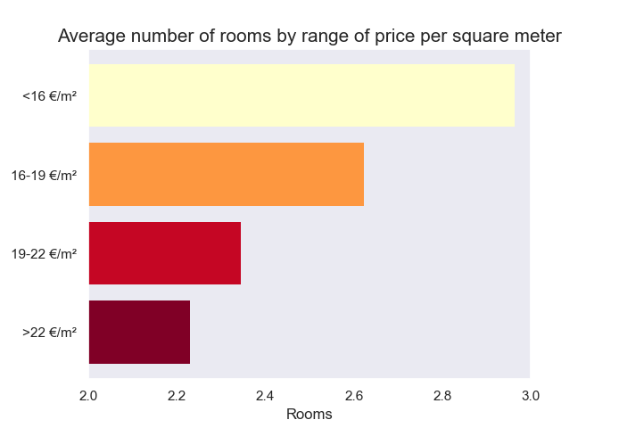

## 3. Modelling
***

>In this section, the process of training a model to estimate house prices based on their features is explained. **The goal was to achieve an RMSE below 300**, which is reasonable given the small dataset. For more details, see the _**Modelling.ipynb**_ file.

### 3.1. First results 

> After preprocessing the data, several regression models were trained. While various metrics were calculated, the chosen metric for comparison was Root Mean Square Error (RMSE), as it has the same dimension as the target (price).
>
>
>> **Results** (Most notable models):    - LinearRegression: _Decent performance in test (RMSE=499) despite its simplicity_    - RandomForestRegresor: _Noteworthy performance in test (RMSE=460 // Best) and massive difference with training (RMSE=235) due to overfitting what might make it optimizable using specific hyperparameters_    - GradientBoostingRegressor: _Best perfomance in test **(RMSE=460)**_
>
> 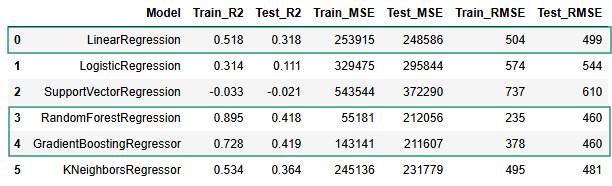

### 3.2. Optimization

> After the initial results, an optimization process was undertaken to achieve the target RMSE (<300).

#### 3.2.1. Dropping extreme values

>> To understand model performance, the differences between the Random Forest model predictions and actual values were analyzed. The highest differences were for highly underestimated listings.
>>
>> 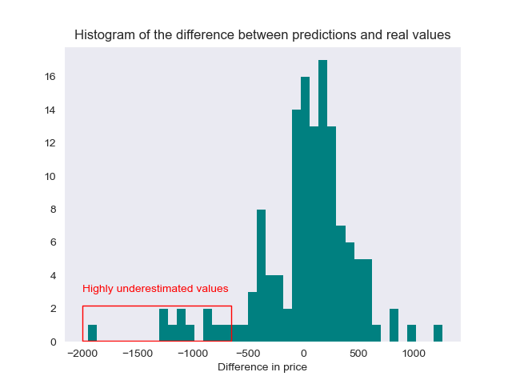
>
>> A scatter plot comparing predictions with real values shows that **extreme values (over €2925) are consistently underestimated** and represent most of the largest errors. In the graph below, we can see also three lines that mark the perfect estimation and the range of +/- 300 (RMSE objective).
>>
>>
>> 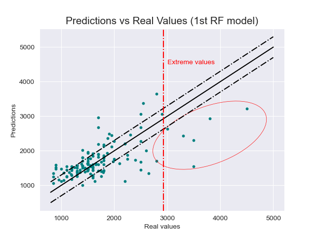
>> **The approach was to drop many of these extreme values** to reduce the artificial error and avoid overestimations in other observations.  Not all extreme values were removed to prevent, on one hand, excessive data loss, and on another one, underestimations in offers around the threshold.
>>
>> This optimization step resulted in a **reduction in the RMSE from 460 to 358 in the Gradient Boosting model.**
>> 

#### 3.2.2. Enriching the dataset with new feature

> While analyzing the most underestimated offers in the website scraped, we identified a potential new feature.  Many of these offers were listed by the same real estate agent: Engel & Völkers. These properties also appeared to be more aesthetically appealing and comfortable. This information was not collected during the initial web scraping, so a **new web scraping process** was conducted to retrieve the agent names associated with each offer.
>
> To assess the impact of the agent on rental prices, we plotted a histogram showing the distribution of price per square meter for different agents. The results revealed a clear distinction, with a gap around 23 €/m², which led to the creation of a **new binary feature, 'Agent_cat', which can be interpreted as distinguishing between premium and non-premium properties.**
>
> 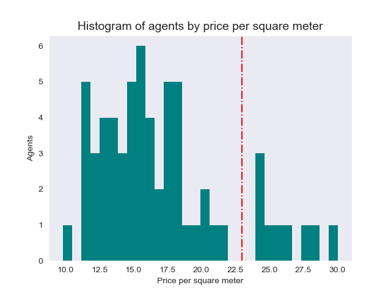
>
> By incorporating this new feature into the model, we achieved an improvement in performance. For example, the **Gradient Boosting model reached a test RMSE of 305.**

#### 3.2.3. Searching best hyperparameters

> Following the introduction of the 'Agent_cat' feature, the Random Forest model had an RMSE of 148 on the training set and 317 on the test set. This significant gap suggested overfitting, prompting an attempt to optimize the hyperparameters in order to improve the model's performance. However, the resulting test RMSE of 306 was not a substantial improvement, making it insufficient to outperform the Gradient Boosting model.
> 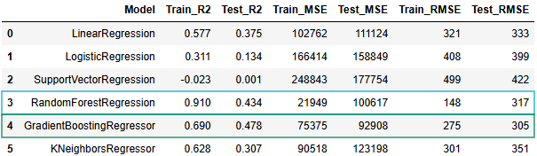    
> **Therefore, the final model selected for use is the Gradient Boosting regressor, which achieved a test RMSE of 305.**

## 4. Next steps
>
> **Several tasks remain uncompleted** due to resource limitations, but it is important to outline them as they can significantly enhance the project in the future. The main tasks include: 
> 
>> **- Acquiring more data to expand the dataset and introduce additional features.** 
>> **- Conducting a similar analysis on the property buying market to compare results and identify investment opportunities.** 
>> **- Periodically updating the dataset to monitor and analyze trends and gain insights into the dynamic behavior of the rental market.** 
